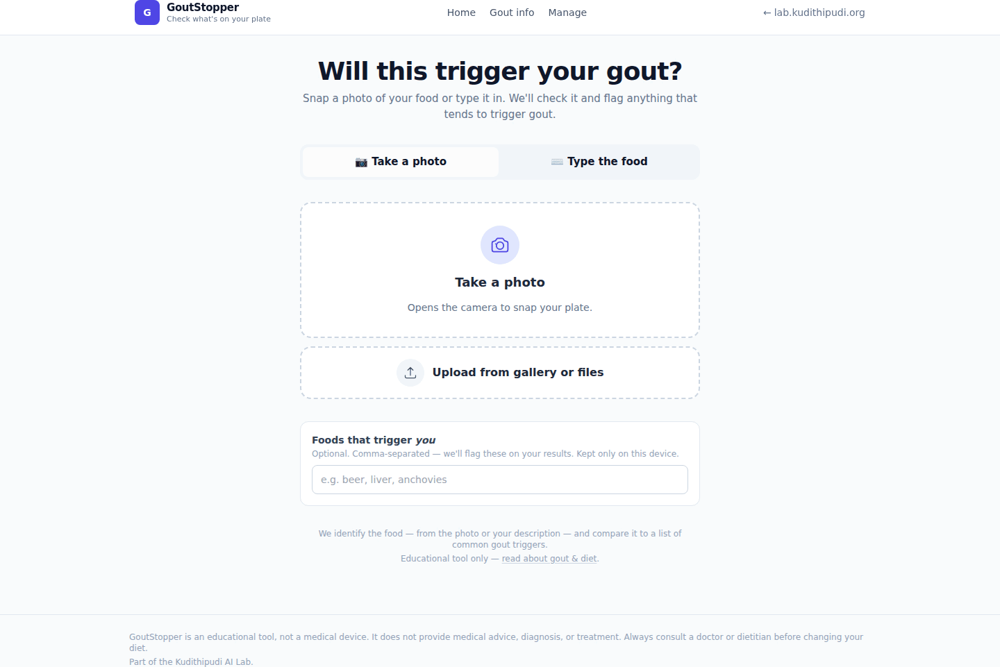
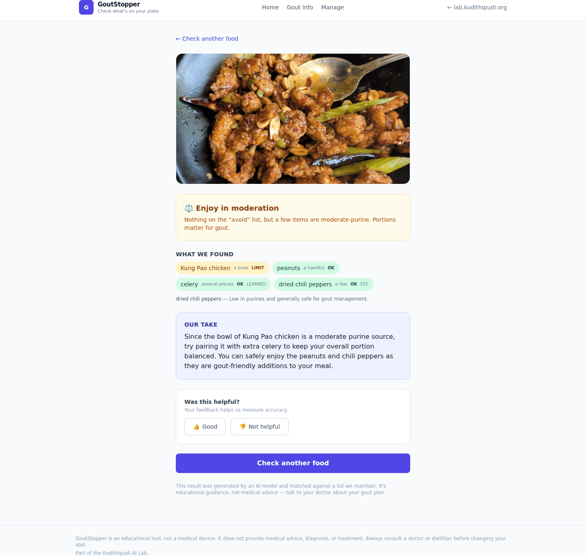
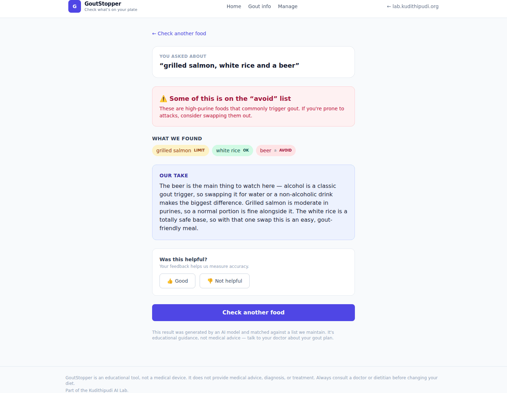

# GoutStopper

[](https://github.com/kudithipudi/gout-stopper/releases)
[](LICENSE)

Check food for gout triggers — either snap a photo of it or just type in what
you plan to eat. The app identifies the food and flags anything that tends to
trigger gout attacks. Educational tool — not medical advice.







## What it is

- Two ways to check food:
  - **Photo**: upload or capture a photo (mobile camera via `capture="environment"`).
  - **Text**: type what you plan to eat, e.g. "a cheeseburger with fries and a beer".
- Separate LLM purposes, each with its own configurable model:
  1. **analyze** (photo) — one vision call: is there food, and what is it?
     (text scans use an **identify** call instead.)
  2. **classify** — rate a food for gout risk when it's on no list (see below).
  3. **advice** — a short, friendly, portion-aware takeaway for someone prone to
     gout. Skipped (with a canned line) when the verdict is a clean "safe".
- Detected items are resolved in three cheap-to-expensive layers:
  1. **Admin list** — deterministic string match (no LLM) against an
     admin-managed list of gout foods in **Avoid / Limit / OK**.
  2. **Learned list** — foods that visitors have 👍-confirmed after an LLM
     estimate; consulted before paying for another call, but only once an
     entry's net 👍 support reaches **+2** (over-generic names like "soup" or
     "sauce" are never learned).
  3. **LLM estimate** — anything still unmatched is rated by the `classify`
     model, and shown marked as an AI estimate.
- **Portions count**: a stated serving size ("two pints", "a single glass")
  nudges the overall verdict up or down — a large portion of a moderate-purine
  food rolls up to "avoid"; a small portion of a trigger rolls one notch down
  (never erasing the per-item flag).
- **Repeat scans are instant**: an identical photo/description reuses the most
  recent result (within `SCAN_CACHE_MAX_AGE_HOURS`) with no LLM calls. The model
  line-up is part of the cache key, so changing a model busts it.
- Every scan is stored (image or typed text + results) and visitors can rate it
  👍/👎. A 👍 on an LLM-estimated food trains the **learned list**; the admin can
  promote a learned food onto the authoritative list or dismiss it.
- **Your recent checks**: the home page shows this browser's own recent scans
  and an optional personal "foods that trigger you" list — all client-side in
  `localStorage`, nothing sent to the server.
- Admin area (password login) to add/delete foods, review the learned list, and
  review recent scans + ratings.
- Basic gout information page with a clear "not medical advice" disclaimer.
- Installable PWA: web app manifest + service worker cache the shell (home,
  about, CSS/JS, icons) for offline access and add-to-home-screen support.
  Scans, admin, and uploads always go straight to the network.

Running at `https://lab.kudithipudi.org/gout-stopper/`.

## Stack

Python 3.12 · FastAPI · SQLite (aiosqlite) · Jinja2 + Tailwind + Alpine.js ·
OpenRouter vision models · gunicorn/uvicorn.

## Run locally

```
python3 -m venv venv
venv/bin/pip install -r requirements.txt
cp .env.example .env   # add OPENROUTER_API_KEY + ADMIN_PASSWORD
venv/bin/uvicorn app.main:app --reload
```

Then open http://127.0.0.1:8000/. The app also works behind a subpath: set
`ROOT_PATH=/gout-stopper` in `.env` for template URL prefixing.

### Rebuilding Tailwind CSS

Tailwind is compiled with the standalone CLI (vendored at `./tailwindcss`) into the
committed `app/static/css/app.css` (no CDN). After editing templates/classes, rebuild:

```
./tailwindcss -i app/static/css/input.css -o app/static/css/app.css --minify
```

Alpine.js is vendored (pinned) at `app/static/js/alpine.min.js`.

## Tests

```
venv/bin/python -m pytest
```

The suite mocks the LLM (no network); it covers the public pages, the scan
lifecycle (photo and text: no-food, avoid verdict, LLM-down, rating), and the
admin login + food CRUD.

## Deploy

- Served by nginx at `https://lab.kudithipudi.org/gout-stopper/` → unix socket
  `/var/www/gout-stopper/gout-stopper.sock` via systemd unit
  `gout-stopper.service` (runs as `www-data`).
- After code changes: `sudo systemctl restart gout-stopper`, then verify
  `curl -s -o /dev/null -w '%{http_code}' https://lab.kudithipudi.org/gout-stopper/`.

## Env vars (`.env`, chmod 600 www-data)

| Variable | Purpose |
|---|---|
| `OPENROUTER_API_KEY` | Required for scans. All LLM calls go through OpenRouter. |
| `ADMIN_PASSWORD` | Password for the `/admin` login form. |
| `SESSION_SECRET` | Signs the admin session cookie (stable secret avoids surprise logouts). |
| `ROOT_PATH` | Public subpath, default `/gout-stopper`. |
| `DB_PATH` | SQLite file, default `data/gout-stopper.db`. |
| `UPLOADS_DIR` | Stored scan photos, default `data/uploads`. |
| `FOOD_DETECT_MODEL` | Model for the photo `analyze` call (food gate + identification). Default `google/gemini-3.1-flash-lite`. |
| `FOOD_IDENTIFY_MODEL` | Model for parsing typed food descriptions. Default `google/gemini-3.1-flash-lite`. |
| `ADVICE_MODEL` | Model for the takeaway text. Default `google/gemini-3.1-flash-lite`. |
| `GOUT_CLASSIFY_MODEL` | Model that rates an off-list food for gout risk. Default `google/gemini-3.1-flash-lite`. |
| `GOUT_CLASSIFY_ENABLED` | Set false to leave off-list foods unrated instead of asking the LLM. Default `true`. |
| `SCAN_CACHE_ENABLED` | Reuse a recent identical scan's results without re-running the LLM. Default `true`. |
| `SCAN_CACHE_MAX_AGE_HOURS` | How long a cached result stays reusable. Default `720` (30 days). |
| `LLM_TEMPERATURE` / `LLM_TIMEOUT` | Call tuning. Default `0.0` / `120` seconds. |
| `MAX_UPLOAD_BYTES` | Max photo upload size in bytes. Default `20971520` (20 MB). |
| `SCAN_RATE_LIMIT_PER_MINUTE` | Per-IP cap on scan endpoints. Default `6`. |
| `ADMIN_LOGIN_RATE_LIMIT_PER_MINUTE` | Per-IP cap on admin login attempts. Default `5`. |
| `LOG_LEVEL` | App + gunicorn log verbosity (`info`, `debug`, ...). Default `info`. |

Any OpenRouter model that accepts image content works (e.g.
`google/gemini-2.5-flash`, `openai/gpt-4o`); per-purpose models can differ.
Avoid models whose reasoning can't be switched off (e.g. `z-ai/glm-5.3-flash`,
`google/gemini-3.5-flash-lite`): a photo scan is three sequential calls, and
hidden thinking turns a ~3s scan into ~30s. Each call logs its model, latency
and token counts at INFO (`LLM analyze google/... 1.4s in=1234 out=56`), so a
slow model shows up in `app/logs/app.log`.

## Logs

Two files under `app/logs/` (gitignored, `www-data`-writable; the directory
itself is tracked via `.gitkeep`):

- `access.log` — gunicorn's access log, one line per HTTP request.
- `app.log` — the app's console output plus gunicorn's error/boot log.

Rotation is handled by the host-level `/etc/logrotate.d/lab-apps` policy — no
per-app rotation. Change verbosity with `LOG_LEVEL` in `.env` and restart the
service; a crash before gunicorn opens its log files still surfaces in journald
(`journalctl -u gout-stopper`).

## Making it your own

Everything the app needs to run is config (`.env`) or seeded data — but a few
things are hard-coded to this deployment. If you fork it, change:

- **Lab branding in `app/templates/base.html`** — the header link and the
  "Part of the Kudithipudi AI Lab" footer line both point at
  `https://lab.kudithipudi.org/`. Repoint or delete them.
- **`gunicorn.conf.py`** — `bind` and `chdir` are absolute
  `/var/www/gout-stopper` paths for the systemd + nginx setup described under
  [Deploy](#deploy). Adjust for your own path / socket, or run under uvicorn.
- **`ROOT_PATH`** — defaults to `/gout-stopper` (in `app/config.py` and
  `.env.example`). Set it to `""` if you serve the app at a domain root, or to
  your own subpath.
- **The `lab.kudithipudi.org` / `lab-apps` references** in this README's
  Deploy and Logs sections are examples from this host — substitute your own.

The gout food list (`app/db.py:DEFAULT_FOODS`) is seeded on first run and then
fully editable from the admin UI, so there's nothing installation-specific
there — but you're welcome to tune the baseline before first launch.

## Versioning & license

The app version lives in `app/__init__.py` (`__version__`) and is reported by
`GET /health`. Releases are git tags (`v1.0.0`, …) with matching GitHub
releases.

MIT — see [LICENSE](LICENSE).
